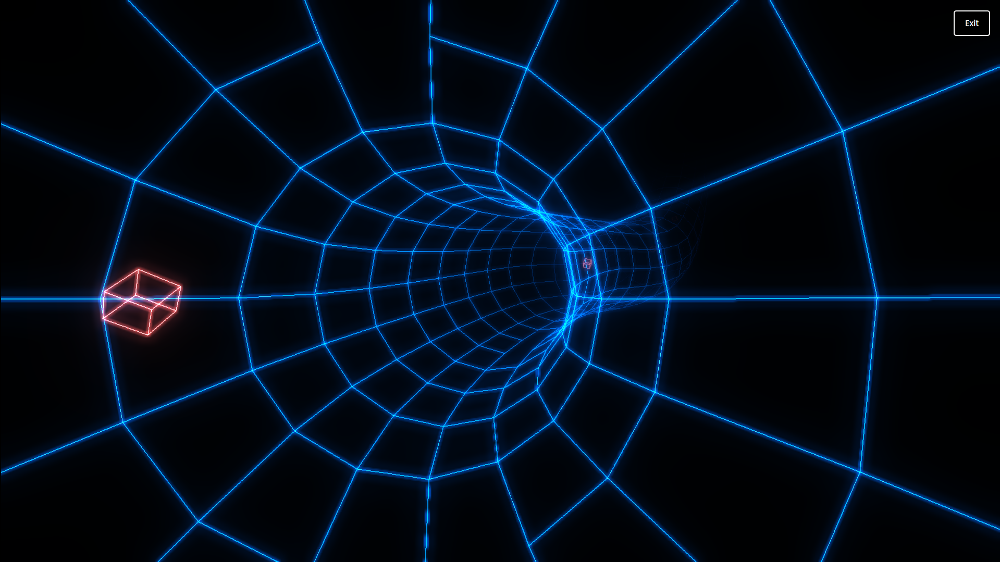

# 🌌 Crazy Tube Realm 3D 🎨

 <!-- Replace with your actual banner image URL -->

## Overview

**Crazy Tube Realm 3D** is an immersive 3D visualization project that synchronizes stunning 3D animations with audio playback. Leveraging the power of Three.js, this project offers dynamic 3D visuals, interactive controls, and a vibrant audio-visual experience. 🚀✨

## Features

- **🎨 3D Visualization**: Animated 3D tube geometry with dynamic camera movements.
- **🎵 Audio Sync**: Synchronize camera movement and scene effects with audio playback.
- **🔄 Interactive Controls**: Easily start and stop the visualization with button controls.
- **🌟 Post-processing Effects**: Enhanced visuals with Unreal Bloom Pass and other effects.
- **📱 Responsive Design**: Adapts seamlessly to various screen sizes and resolutions.

## Getting Started

To get started with this project, follow these steps:

### Prerequisites

- 🌐 A modern web browser (e.g., Chrome, Firefox)
- 🧰 Node.js and npm (for development purposes)

### Installation

1. **Clone the repository:**

   ```bash
   git clone https://github.com/your-username/crazy-tube-realm-3d.git
